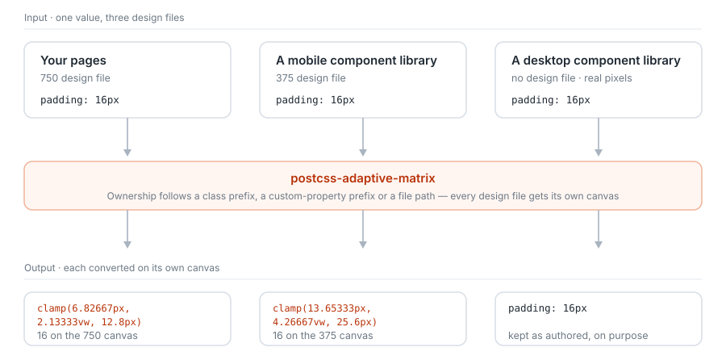

# Documentation

**English** · [简体中文](./README.zh-CN.md)

Pick the page that matches what you are doing right now:

| What you want | Read this |
| --- | --- |
| Install it and get a first page working | [Getting started](./getting-started.md) |
| Try a configuration without installing anything | [Playground](./playground.md) |
| Wire it into Vite / Nuxt / Webpack / Taro | [Build tool integration](./integration.md) |
| Check the output after changing configuration | [CLI preview](./cli.md) |
| The project uses Vant / Element Plus / antd… | [Component libraries](./libraries.md) |
| Look up an option name or its default | [Configuration reference](./configuration.md) |
| Understand where the numbers come from | [Architecture and formulas](./architecture.md) |
| Keyboards / address bars / WebViews break the layout | [Optional runtime](./runtime.md) |
| Support an old Safari or WebView | [Browser support and degradation](./compatibility.md) |
| Move over from an existing px conversion setup | [Migration guide](./migration.md) |
| Releases, artifacts, Node versions | [Release and compatibility](./release.md) |

Specification and examples:

- [Conformance suite](../conformance/README.md) — a language-agnostic behavioural definition, pure data, usable as an acceptance suite by an implementation in any language
- [Runnable example](../examples/app-pc/) — a complete app 375 + desktop 1440 project

## The core model

This project solves exactly one problem: a `px` cannot be converted until you know which design file it was drawn on.

Your pages, a mobile component library and a desktop component library come from three different design files — and the third one may have no design file at all. Giving each file its own **canvas** (a profile), and converting every `px` against the width of the canvas it belongs to, is the only approach that does not force a choice between "the page scales but the components stay put" and "the components get stretched against the wrong ratio".

Canvas membership is decided by three channels: class-name prefix, custom-property prefix, and file path. The channels for the built-in component libraries are already written, which is why the default configuration is already correct.
