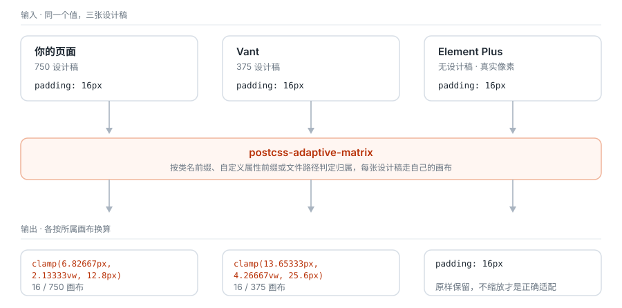

# 文档

按你现在要做的事情挑一篇：

| 你想做的事 | 读这里 |
| --- | --- |
| 装上去，跑通第一个页面 | [快速上手](./getting-started.md) |
| 接进 Vite / Nuxt / Webpack / Taro | [构建工具集成](./integration.md) |
| 项目里用了 Vant / Element Plus / antd… | [组件库适配](./libraries.md) |
| 查某个选项叫什么、默认值是多少 | [配置参考](./configuration.md) |
| 想知道数字是怎么算出来的 | [架构与转换公式](./architecture.md) |
| 软键盘 / 地址栏 / WebView 把布局顶歪了 | [可选运行时](./runtime.md) |
| 从现有的 px 换算方案换过来 | [迁移指南](./migration.md) |
| 发版、产物、浏览器支持 | [发布与兼容性](./release.md) |

规范与示例：

- [一致性套件](../conformance/README.md)——语言无关的行为定义，纯数据，任何语言的实现都能拿它做验收
- [可运行示例](../examples/app-pc/)——App 375 + PC 1440 的完整工程

## 核心模型

整个项目只解决一件事：一个 `px` 要先知道自己画在哪张设计稿上，才谈得上换算。

页面、移动组件库、桌面组件库来自三张不同的稿子——甚至第三张根本没有稿子。给每张稿子一个**画布**（profile），每个 `px` 按自己画布的宽度换算，是唯一不需要在「页面缩放但组件不动」和「组件被按错误比例拉变形」之间二选一的做法。

画布归属由三条通道判定：类名前缀、自定义属性前缀、文件路径。内置组件库的通道已经写好，所以默认配置就是对的。
