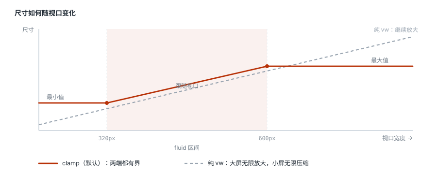

# 快速上手

## 安装

```bash
npm i -D postcss postcss-adaptive-matrix
```

## 最小配置

只有一张设计稿时：

```js
// postcss.config.mjs
import adaptiveMatrix from 'postcss-adaptive-matrix'

export default {
  plugins: [
    adaptiveMatrix({
      defaultProfile: 'app',
      profiles: {
        app: {
          designWidth: 375,
          fluid: { minWidth: 320, maxWidth: 480 },
        },
      },
    }),
  ],
}
```

`designWidth` 是设计稿宽度，`fluid` 是尺寸继续跟随视口变化的区间。区间之外尺寸停住——这是与纯 `vw` 方案最大的区别，详见[有界流体](#有界流体)。

## 双设计稿：App + PC

设计团队交付两个画布时用 `appPcPreset`：

```js
import adaptiveMatrix, { appPcPreset } from 'postcss-adaptive-matrix'

export default {
  plugins: [
    adaptiveMatrix(
      appPcPreset({
        appDesignWidth: 375,
        pcDesignWidth: 1440,
        rootSelector: '#app',
      }),
    ),
  ],
}
```

预设给出的约定：

| | App | PC |
| --- | --- | --- |
| 设计宽度 | 375 | 1440 |
| 流体区间 | 320 ~ 480 | 1024 ~ 1920 |
| 生效条件 | 默认 | `@media (min-width: 768px)` |

## 写业务 CSS

基础选择器写两端共有的部分——布局结构、颜色、交互状态。只把尺寸真正不同的内容放进 `@adaptive pc`，不要维护两份页面：

```css
.product-card {
  display: grid;
  gap: 12px;
  padding: 16px;
  border-radius: 12px;
}

@adaptive pc {
  .product-card {
    grid-template-columns: 320px 1fr;
    gap: 32px;
    padding: 32px;
  }
}
```

输出：

```css
.product-card {
  display: grid;
  gap: clamp(10.24px, 3.2vw, 15.36px);
  padding: clamp(13.65333px, 4.26667vw, 20.48px);
  border-radius: clamp(10.24px, 3.2vw, 15.36px);
}

@media (min-width: 768px) {
  .product-card {
    grid-template-columns: clamp(227.55556px, 22.22222vw, 426.66667px) 1fr;
    gap: clamp(22.75556px, 2.22222vw, 42.66667px);
    padding: clamp(22.75556px, 2.22222vw, 42.66667px);
  }
}
```

普通规则按默认 `app` 画布转换；`@adaptive pc` 块按 1440 画布转换，并包裹进 PC 媒体查询。

## 有界流体



**断点和流体区间不是一回事。** 断点决定哪套布局生效，流体区间决定尺寸在哪段区间里继续缩放。

上面的配置里，App 规则在 768px 之前一直生效，但尺寸到 480px 就停止放大——600px 宽的小平板因此不会看到被粗暴放大的手机 UI。PC 从 768px 起生效，但尺寸在 1024px 以下保持下限，窄窗口不会被过度压缩。

## 文字

字号不走纯 `vw`，而是 `rem + vw` 的混合公式：

```css
.title { font-size: 16px }
```

```css
.title { font-size: clamp(0.94867rem, calc(0.65rem + 1.49333vw), 1.098rem) }
```

静态部分用 `rem`，因此浏览器的文字缩放设置依然有效（WCAG 1.4.4）。纯 `vw` 文字会把用户的缩放选择完全吃掉。混合比例由 `fontFluidity` 控制，默认 `0.35`；在设计宽度处结果仍严格等于设计值。

## 根容器

传入 `rootSelector` 后，插件追加一个低优先级的 `@layer adaptive-matrix`：

- 根元素 `inline-size: 100%`，水平居中；
- App 与 PC 各自在流体上限处停止增长；
- 注入 `env(safe-area-inset-*)` 安全区变量；
- 发布根列宽与留白变量，并据此修正 `position: fixed`。

最后一条值得单独说：页面一旦成为居中的列，`position: fixed` 会退回以视口为包含块，底部导航栏就贴到了窗口两端，与它所在的内容列错开。`appPcPreset` 默认修正这一点，不需要时传 `fixedContainingBlock: false`。参见[配置参考](./configuration.md#fixedcontainingblock)。

已经自己管理根容器的项目省略 `rootSelector` 即可，插件不会注入任何全局 CSS。

### 组件化项目要指定注入位置

这段基础样式是全局的，但 PostCSS 一次只看见一个文件，没有跨文件去重的余地。所以默认每个被处理的文件都会拿到一份。

只有一份全局样式表的项目，这正是想要的。Vue / Svelte 项目则相反：**每个组件的 `<style>` 块都是独立的一个文件**，默认行为等于给 150 个组件各塞一份安全区变量和根列规则。

指到入口样式表上，就只注入一次：

```js
appPcPreset({
  rootSelector: '#app',
  rootInjectTo: 'src/styles/main',   // 字符串按「包含」匹配
})
```

也接受正则和函数，规则与 `include` 一致。直接写 `root` 时对应字段是 `root.injectTo`。

匹配不上不会报错，只是一份都不注入。用[命令行](./cli.md)确认一下最稳妥——入口文件应当出现 `+ inline-size 100%` 这类新增声明：

```bash
npx adaptive-matrix src/styles/main.css -c postcss.config.mjs
```

## 组件库

不需要配置。内置的 11 个主流库按各自设计画布换算，桌面端组件库保留真实像素，主题 token 按名字识别并走文字混合公式。完整清单与覆盖方式见[组件库适配](./libraries.md)。

## 局部关闭

```css
/* adaptive-ignore-next */
width: 320px;

height: 44px; /* adaptive-ignore */

/* adaptive-ignore-rule */
.widget { width: 300px }
```

这三个注释会**保留在产物里**。被忽略的 `40px` 和没人管过的 `40px` 长得一模一样，注释一旦被吃掉，产物再过一遍编译（预编译的依赖被消费方再编译一次就是这种情况）就会把它换算了。注释本身会被任何压缩器去掉。

范围更大的排除用 `propList`、`selectorExclude`、`valueExclude`、`exclude`，或用 `routes` 把某一片 CSS 改派到 `profile: false`。

## 验收尺寸

建议至少在这些宽度做视觉回归：320、375、480、767、768、1024、1440、1920、2560。

另测：浏览器 200% 文字缩放、iOS 安全区、Android WebView 软键盘、横屏、以及使用容器查询的组件。
