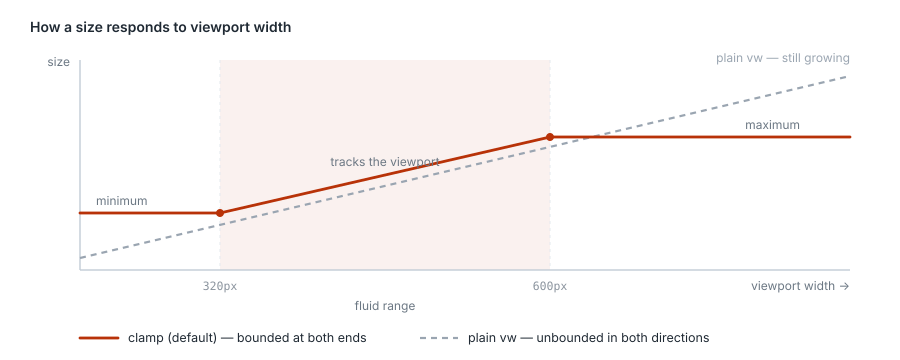

# Getting started

**English** · [简体中文](./getting-started.zh-CN.md)

## Install

```bash
npm i -D postcss postcss-adaptive-matrix
```

## Minimal configuration

With a single design file:

```js
// postcss.config.mjs
import adaptiveMatrix from 'postcss-adaptive-matrix'

export default {
  plugins: [adaptiveMatrix({ profiles: { app: 375 } })],
}
```

`375` is shorthand for `{ designWidth: 375 }`. A single profile is selected automatically, so `defaultProfile` is unnecessary here. This custom profile has no fluid bounds. To use the built-in bounded presets instead, call `adaptiveMatrix()` with no configuration.

Bounds are optional: add `fluid: { minWidth: 320 }` to stop shrinking below 320px, `fluid: { maxWidth: 480 }` to stop growing above 480px, or both for a bounded interval. Omitting `fluid` or passing `{}` leaves both ends open. See [Bounded fluid sizing](#bounded-fluid-sizing).

## Two design files: app + desktop

When the design team delivers two canvases, use `appPcPreset`:

```js
import adaptiveMatrix, { appPcPreset } from 'postcss-adaptive-matrix'

export default {
  plugins: [
    adaptiveMatrix(
      appPcPreset({
        appDesignWidth: 375,
        pcDesignWidth: 1440,
        rootSelector: '#app',
      }),
    ),
  ],
}
```

What the preset decides for you:

| | App | Desktop |
| --- | --- | --- |
| Design width | 375 | 1440 |
| Fluid range | 320 – 480 | 1024 – 1920 |
| Applies when | default | `@media (min-width: 768px)` |

The helper validates at its own call boundary. Unknown option names include a spelling suggestion and every design/bound width must be finite and positive. `root: true` or a root-only setting that configures/enables the foundation enables it on `:root`; `rootSelector` is needed only to override that selector. Merely setting an already-off capability (`container: false` or `fixedContainingBlock: false`) does not inject global CSS. Explicit `root: false` rejects settings that would otherwise enable or customise the foundation instead of silently ignoring them.

## Writing your CSS

Put everything both ends share — layout structure, colour, interaction states — in the base selector. Only what genuinely differs in size goes into `@adaptive pc`. Do not maintain two copies of the page:

```css
.product-card {
  display: grid;
  gap: 12px;
  padding: 16px;
  border-radius: 12px;
}

@adaptive pc {
  .product-card {
    grid-template-columns: 320px 1fr;
    gap: 32px;
    padding: 32px;
  }
}
```

Output:

```css
.product-card {
  display: grid;
  gap: clamp(10.24px, 3.2vw, 15.36px);
  padding: clamp(13.65333px, 4.26667vw, 20.48px);
  border-radius: clamp(10.24px, 3.2vw, 15.36px);
}

@media (min-width: 768px) {
  .product-card {
    grid-template-columns: clamp(227.55556px, 22.22222vw, 426.66667px) 1fr;
    gap: clamp(22.75556px, 2.22222vw, 42.66667px);
    padding: clamp(22.75556px, 2.22222vw, 42.66667px);
  }
}
```

Ordinary rules convert on the default `app` canvas; the `@adaptive pc` block converts on the 1440 canvas and is wrapped in the desktop media query.

## The other kind of two-ended project: two page trees, split by folder

The style above is **one page, two design files** — shared parts written once, differences in `@adaptive pc`.

The other common arrangement is **two page trees**: `src/mobile/**` and `src/pc/**`, each complete on its own, with routing or the entry point deciding which one you land in. Such a project needs no `@adaptive` in its CSS at all — file routing is enough:

```js
{
  defaultProfile: 'app',
  profiles: {
    app: { designWidth: 750, fluid: { minWidth: 320, maxWidth: 600 } },
    pc:  { designWidth: 1440, fluid: { minWidth: 1024, maxWidth: 1920 } },
  },
  routes: [
    { profile: 'pc',  file: [/[\\/]pc[\\/]/] },
    { profile: 'app', file: [/[\\/]mobile[\\/]/] },
  ],
}
```

The same `padding: 32px` converts against whichever design file its folder belongs to:

| File | Output |
| --- | --- |
| `src/mobile/home/index.vue` | `clamp(13.65333px, 4.26667vw, 25.6px)` |
| `src/pc/home/index.vue` | `clamp(22.75556px, 2.22222vw, 42.66667px)` |

**The key point: file routing only decides which design file to convert against. It never wraps a rule in a media query.** That is exactly what this kind of project needs — which page tree is displayed has already been decided by routing, and CSS should not decide it a second time. Both outputs above are unconditional.

An SFC's `from` carries a query string (`index.vue?vue&type=style&index=0&lang.css`), so write `file` patterns as "contains" rather than anchoring them to the end — see [Build tool integration](./integration.md#3-a-vue-sfc-path-carries-a-query-string).

### Which canvas do shared components land on

`src/components/**` is used by both ends and matches neither route, so it falls through to `defaultProfile`. Three choices:

1. **Just use the default canvas** — correct when the component is meant to look the same on mobile and desktop;
2. **Split one more folder level by purpose**, `src/components/mobile/**` and `src/components/pc/**`, each matching a route;
3. **Use `@adaptive pc` inside the component** — but under this section's configuration that has a trap, below.

### The trap: with no `query`, `@adaptive` becomes an unconditional rule

Neither profile in this section has a `query`, because switching is not CSS's job here. But the moment someone writes this in a shared component:

```css
.shared-card { padding: 32px }
@adaptive pc { .shared-card { padding: 48px } }
```

the `pc` canvas has no `query`, so there is no wrapper to put it in and the block is unwrapped instead — both rules are unconditional, and the second one comes later in the file, so **it wins at every viewport**:

```css
.shared-card { padding: clamp(13.65333px, 4.26667vw, 25.6px) }
.shared-card { padding: clamp(34.13333px, 3.33333vw, 64px) }   /* always the one that applies */
```

The compiler warns about this and offers two exits: give `pc` a `query`, or write `query: false` to state that switching happens outside CSS (one artifact per end, or a canvas chosen by environment variable). Once `query: false` is written the warning stops — that is a question you have already answered.

`@adaptive app` on its own canvas does not warn: there is no switch, and unwrapping loses nothing.

### Component libraries need no attention

Vant on mobile and Element Plus on desktop both live in `node_modules` and match neither folder route, so each is claimed by the built-in registry — Vant on the 375 canvas, Element Plus left in real pixels. No extra configuration.

The one thing to watch is that **your routes take priority over library routes**, so write folder patterns specifically enough: `/[\\/]pc[\\/]/` only matches a standalone `pc` segment, whereas `/pc/` would catch any dependency with those three letters anywhere in its path.

## Bounded fluid sizing



**A breakpoint and a fluid range are not the same thing.** A breakpoint decides which layout applies; a fluid range decides across which span sizes keep scaling.

In the configuration above, the app rules apply all the way up to 768px, but sizes stop growing at 480px — so a 600px tablet does not get a phone UI crudely blown up. Desktop applies from 768px, but sizes hold their floor below 1024px, so a narrow window is not over-compressed.

## Text

Font sizes do not use plain `vw`; they use a `rem + vw` hybrid:

```css
.title { font-size: 16px }
```

```css
.title { font-size: clamp(0.94867rem, calc(0.65rem + 1.49333vw), 1.098rem) }
```

The static part is in `rem`, so it responds to the root font size. The mix is controlled by `fontFluidity`, default `0.35`; at the design width the result is still exactly the design value. This is not a guarantee of proportional text resizing: test zoom, clipping and reflow on your actual page. See [the scaling example and its limits](./architecture.md#text-lengths-and-accessibility).

To make converted text depend only on the root font size, set `fontFluidity: 0`. Spacing and other non-text lengths still scale with the viewport; no fluid bounds are required:

```js
adaptiveMatrix({
  profiles: { app: 375 },
  fontFluidity: 0,
})
```

With the default `rootValue: 16`, `font-size: 16px` becomes `font-size: calc(1rem)`. The function wrapper preserves repeat-build stability. This changes the text-sizing formula, not the need to test the surrounding layout.

## The root container

Pass `root: true` and the plugin appends a low-priority `@layer adaptive-matrix` to `:root`. Use `rootSelector` only when another element, such as `#app`, carries the layout; supplying it also enables the foundation:

- the root element gets `inline-size: 100%` and is centred horizontally;
- app and desktop each stop growing at their fluid ceiling;
- `env(safe-area-inset-*)` safe-area variables are injected;
- the root column width and gutter are published as variables, and `position: fixed` is corrected against them.

That last one deserves its own note: once the page is a centred column, `position: fixed` falls back to the viewport as its containing block, so a bottom navigation bar sticks to the window edges, out of line with the content column it belongs to. `appPcPreset` corrects this by default; pass `fixedContainingBlock: false` if you do not want it. See [Configuration reference](./configuration.md#fixedcontainingblock).

A project that already manages its own root container can omit all root settings (or explicitly pass `root: false`), and the plugin injects no global CSS at all.

### Component-based projects must say where to inject

This foundation is global, but PostCSS only ever sees one file at a time and has no way to deduplicate across files. So by default every processed file gets a copy.

For a project with a single global stylesheet, that is exactly right. Vue and Svelte projects are the opposite: **every component's `<style>` block is a separate file**, so the default means handing 150 components their own copy of the safe-area variables and root column rules.

Point it at the entry stylesheet and it is injected once:

```js
appPcPreset({
  rootSelector: '#app',
  rootInjectTo: 'src/styles/main',   // a string matches by "contains"
})
```

Regular expressions and functions are accepted too, with the same rules as `include`. When writing `root` directly the field is `root.injectTo`.

A pattern that matches nothing is not an error — it just injects nothing. Confirm with the [CLI](./cli.md); the entry file should show added declarations like `+ inline-size 100%`. The CLI takes compiler options, not PostCSS's `{ plugins: [...] }` wrapper. Put the shared options in `adaptive.config.mjs`:

```js
import { appPcPreset } from 'postcss-adaptive-matrix'

export default appPcPreset({
  rootSelector: '#app',
  rootInjectTo: 'src/styles/main',
})
```

```bash
npx adaptive-matrix src/styles/main.css -c adaptive.config.mjs
```

## Component libraries

Nothing to configure. The 11 built-in mainstream libraries convert against their own design canvas, desktop libraries keep real pixels, and theme tokens are recognised by name and take the text hybrid formula. For the full list and how to override, see [Component libraries](./libraries.md).

## Turning it off locally

```css
/* adaptive-ignore-next */
width: 320px;

height: 44px; /* adaptive-ignore */

/* adaptive-ignore-rule */
.widget { width: 300px }
```

These three comments **survive into the output**. An ignored `40px` and a `40px` nobody ever looked at are indistinguishable, so if the comment were dropped, a second compilation pass (which is exactly what happens when a pre-compiled dependency is compiled again by its consumer) would convert it. Any minifier removes the comments themselves.

For broader exclusions use `propList`, `selectorExclude`, `valueExclude`, `exclude`, or route a section of CSS to `profile: false`.

## Widths worth testing

Visual regression at least at: 320, 375, 480, 767, 768, 1024, 1440, 1920, 2560.

Also test: 200% browser text zoom, the iOS safe area, the Android WebView on-screen keyboard, landscape orientation, and any component using container queries.
